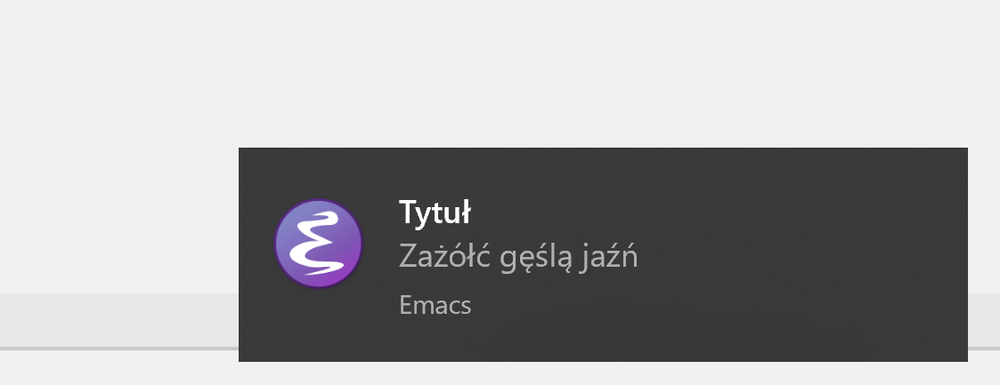

This package defines a new alert style (`toast`) for
[alert.el](https://github.com/jwiegley/alert) using Windows 10 toast
notifications. It works with native Windows 10 Emacs versions and with Emacs run
under Windows Subsystem for Linux (WSL) or under Cygwin. These notifications are
limited to a single-line title and four lines of text. Longer text can be passed
but it will be truncated by Windows 10.



# Install

The package is available on [MELPA](https://melpa.org) and can be installed with Emacs package managers.

## package.el

Ensure that `package.el` is initialized and uses MELPA as a source of packages:

``` emacs-lisp
(require 'package)
(add-to-list 'package-archives '("melpa" . "https://melpa.org/packages/") t)
(package-initialize)
```

Install and load `alert-toast` with:

``` emacs-lisp
(package-install 'alert-toast)
(require 'alert-toast)
;; (setq alert-default-style 'toast)
```

## use-package

You can install `alert-toast` and set it as the default style with:

``` emacs-lisp
(use-package alert
  :commands (alert)
  :config (setq alert-default-style 'toast))
  
(use-package alert-toast
  :after alert)
```

# Usage

This package defines a new alert style (`'toast`), so use it the same way you would use any other style. To set it as the default alert style, put the following in your init file:
``` emacs-lisp
(setq alert-default-style 'toast)
```
or to use it with [mu4e-alert](https://github.com/iqbalansari/mu4e-alert), you should put:
``` emacs-lisp
(mu4e-alert-set-default-style 'toast)
```

## Priorities
Looking at [Windows.UI.Notifications
API](https://docs.microsoft.com/en-us/uwp/api/windows.ui.notifications.toastnotification?view=winrt-19041),
toast notifications seem to support 2 priority levels: High and Default. Mapping
between alert.el priorities and these levels is defined by
`alert-toast-priorities`. According to API docs, high priority toast may wake up
the screen if it's in standby mode. I haven't actually noticed any difference
between default and high priority toasts.

## Icons
Icons located on network shares are not supported. This includes icons on the
WSL virtual drive, therefore for Emacs running under WSL the default Emacs icon
is copied to `C:\Users\<user>\AppData\Local\Emacs-Toast\Emacs.png`. PNG version
is used because toast notifications render SVG graphics as tiny and put them in
top left corner of the notification. A different default icon can be set be
changing `alert-toast-default-icon`.

Under WSL or Cygwin, a path to a custom icon should be given as a WSL/Cygwin
path (`/mnt/c/...` or `/cygdrive/c/...`) instead of a Windows path (`C:\\...`).

## Fade time
The global `alert.el` variable controlling how long a notification persists is
`alert-fade-time`. For this package, this is the number of seconds a toast
persists in the action center before being removed for good. This is not the
number of seconds the toast is visible before sliding out of sight. The amount
of time the toast is visible is controlled by `:long` property of `:data` plist,
which can either be `t` or `nil` (default). The default short notification lasts
for several seconds, a long one last for around ~20 s:

``` emacs-lisp
(alert-toast-notify '(:title "Tytuł" :message "Zaźółć gęślą jaźń" :data (:long t)))
```

## Functionality specific to `alert-toast.el`
`alert.el` allows passing alert provider-specific options in the `:data`
property. `alert-toast.el` expects the value of `:data` to be another plist with
properties:

- `:audio`, one of symbols found in `alert-toast--sounds` or `alert-toast--looping-sounds`.
  Choosing one of the latter implies a long, looping notification.
- `:long`, `t` or `nil`. See [Fade time](#fade-time).
- `:loop`, `t` or `nil`. Loop the notification sound.
- `:silent`, `t` or `nil`. Disable sound.

For example:
``` emacs-lisp
(alert-toast-notify '(:title "Tytuł" :message "Zaźółć gęślą jaźń" :data (:audio alarm5)))
```

`alert-toast.el` also supports [shoulder
taps](https://docs.microsoft.com/en-us/windows/uwp/contacts-and-calendar/my-people-notifications)
aka My People notifications. To use it, provide email of the contact as the
`:shoulder-person` property of the `:data` plist in `mailto:<email>` format and
an address (local or http) of a GIF or PNG image as `:shoulder-payload` property.
If the file is local and you're using Cygwin or WSL, then convert the path to
native Windows path with `(alert-toast--icon-path path)`. The contact with the
provided email address needs to be pinned to the taskbar beforehand, otherwise
you'll get a standard toast notification.

For example:

``` emacs-lisp
(alert-toast-notify '(:title "Fallback title" :message "Fallback body" :data (:shoulder-person "mailto:your.pinned.contact@domain.com" :shoulder-payload "https://docs.microsoft.com/windows/uwp/contacts-and-calendar/images/shoulder-tap-static-payload.png")))
```

**Note:** Shoulder taps are known to be [flaky](https://github.com/Windos/BurntToast/issues/66). 

## Bugs
There is an issue in WSL where wslhost.exe dies or never starts properly for no
discernible reason, which prevents accessing Windows partitions and executables
[](https://github.com/microsoft/WSL/issues/6161). If this happens then you
should see a message that powershell.exe cannot be found. This will prevent this
package from working. The only known workaround is to call `wsl --shutdown` and
start WSL again.

# Other works
[erc-burnt-toast](https://github.com/mplscorwin/erc-burnt-toast) also implements
toast notifications but in the context of the Emacs IRC client. It uses an
external PowerShell module [burnt-toast](https://github.com/Windos/BurntToast).

`alert.el` bundles `toaster` style which also provides toast notifications but
requires an external C# utility.

Windows builds of Emacs include `w32-notification-notify` function which shows a
tray icon with a tooltip as a notification.
